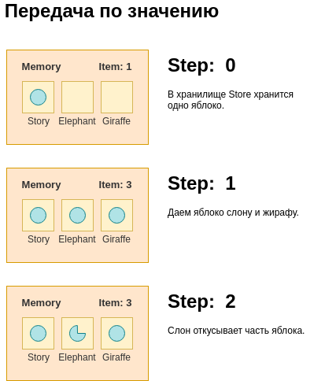

# Система типов, тип данных, значимые и ссылочные типы

Представьте, что вы находитесь в центре пустыни Невады и вокруг вас на максимальной скорости хаотично разъезжают сотни ревущих бульдозеров за рулем которых сидят макаки с завязанными глазами. Кажется, что дожить до момента когда у них закончится топливо практически не реально. Подобный пример максимально близко описывает отсутствие типизации. Противоположностью является продуманная дорожная инфраструктура состоящая не только из самих дорог, но и подземных\наземных переходов, светофоров и регулировщиков. Ключевым моментом является понимание что ваша безопасность достигается путем _ограничения_ транспорта. Другими словами типизация сопоставимая с дорожной инфраструктурой ограничивает возможности разработчика таким образом, что процесс создания программ становится для него более комфортным. Типизация не расширяет возможности разработчиков, она их ограничивает, пуская их энергию в правильное русло.

В зависимости от среды выполнения, операции над данными могут быть ограничены некими правилами. Для каждого конкретного вида данных декларируются конкретные правила. В роли конкретного свода правил выступает тип данных.

Среда выполнения, в которой отсутствует классификация данных и ограничения на операции над ними, не имеет типов, поэтому такую среду выполнения справедливо называть нетипизированной. И наоборот, среду выполнения, которая классифицирует данные и операции над ними, справедливо называть типизированной.

В основе любой типизированной среды выполнения лежит такое фундаментальное понятие, как _система типов_. Сложно сформулировать исчерпывающие определение термину _система типов_, затронув все аспекты, все значения, которые вкладывают в этот термин разработчики из различных областей, поэтому конкретизируем его самым простым определением.

## Система Типов

_Система Типов_ - это совокупность правил назначающих конструкциям составляющим программу свойства (имеется ввиду характеристики) именуемые _типами_. Обычно к конструкциям нуждающимся в аннотации типов относятся переменные, поля и свойства объектов, а также параметры и возвращаемые функциями значения.

В основе системы типов любого языка программирования всегда лежит _базисная система типов_ встроенных в язык. К базисным или встроенным типам относятся такие типы, как `byte`, `int`, `string`, `boolean`, `object` и им подобные. На их основе среда выполнения или разработчик могут определять типы данных более высокого уровня, например `Date` или `Array`.

## Тип данных (тип)

Понятие _тип_ является фундаментальным в теории программирования. Тип данных (или просто тип) — это характеристика определяющая множество значений и операций, которые могут быть выполнены над этими данными.

В зависимости от языка программирования, тип данных может хранить информацию о данных, к которым относятся поля, свойства, методы и другие структуры языка, а также о том, в каком месте, в _стеке_ (_stack_) или _куче_ (_heap_) будет выделяться память во время выполнения программы и её объем; в каких операциях (как, например, сложение `+`, умножение `*`, присваивание `=` и т.д.) может участвовать тип данных.

Типы данных делятся на два вида:
 
 - _типы значения_ (_value type_) - хранят значение (их ещё называют _значимыми типами_)
 - _ссылочные типы_ (_reference types_) - хранят ссылку на значение

При операции присваивания значения принадлежащего к значимому типу данные копируются (дублируются) в памяти. При операции присваивания значения, принадлежащему к ссылочным типам, копируется лишь ссылка на данные.

## Тип данных, передающийся по значению (примитивный тип)

Когда переменная, ассоциированная со значением принадлежащим к значимому типу участвует в операции присвоения, операнд из левой части будет ассоциирован не со значением правого операнда, а с его копией. Другими словами, значение будет дублировано в памяти и переменные будут ассоциированы с разными значениями-участками памяти. При изменении любой переменной своего значения, значения других переменных затронуты не будут.

  

Обычно говорят, что переменные с типом значения хранят значение и передаются по значению.

## Тип данных, передающийся по ссылке

Если переменная ассоциированная со ссылочным типом данных участвует в операции присваивания, операнду из левой части будет присвоена ссылка на значение, с которым ассоциирован операнд из правой части. Другими словами обе переменные будут ассоциированы с одним и тем же значением и участком памяти. В таком случае, если изменить значение любой ссылочной переменной, изменения затронут все переменные, ассоциированные с этим значением.

 

Обычно говорят, что переменные ссылочного типа ссылаются на значение и передаются по ссылке.
